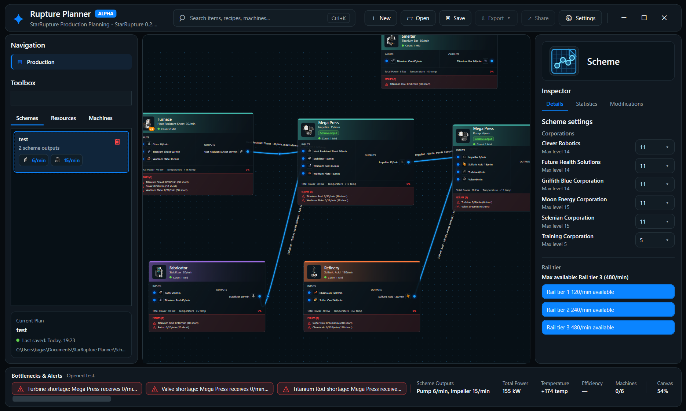
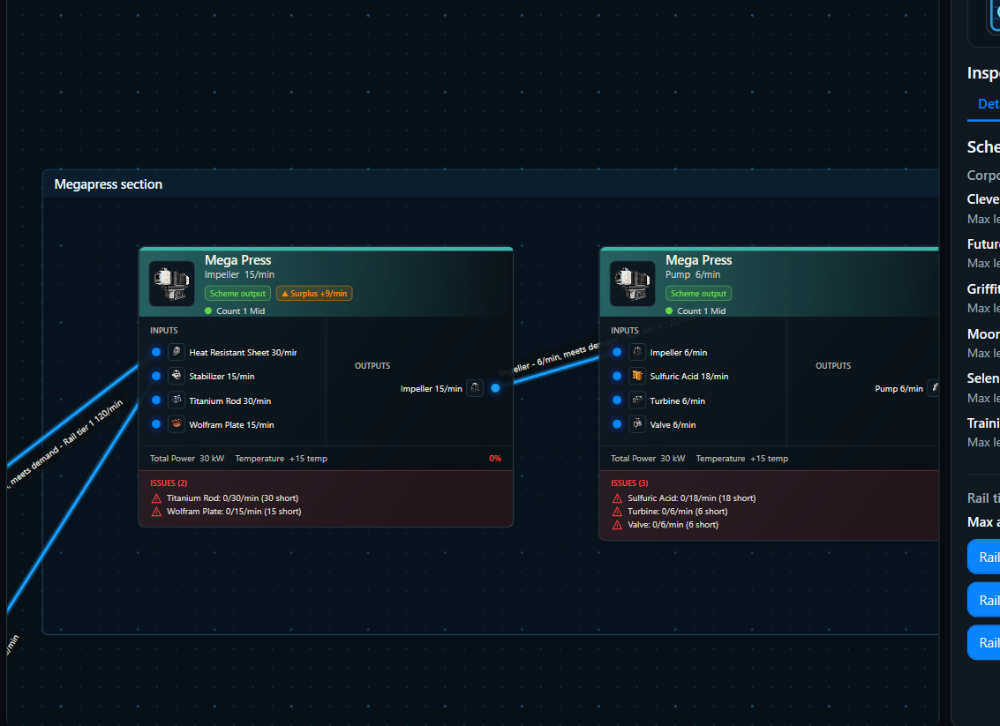
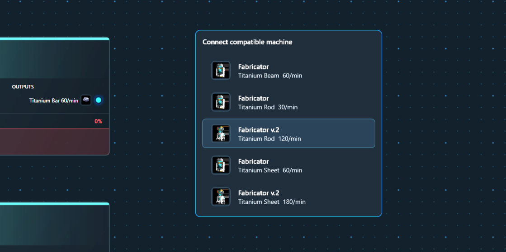
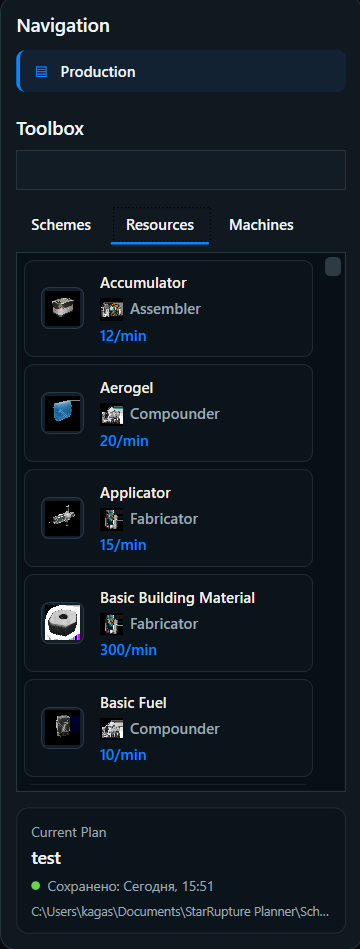
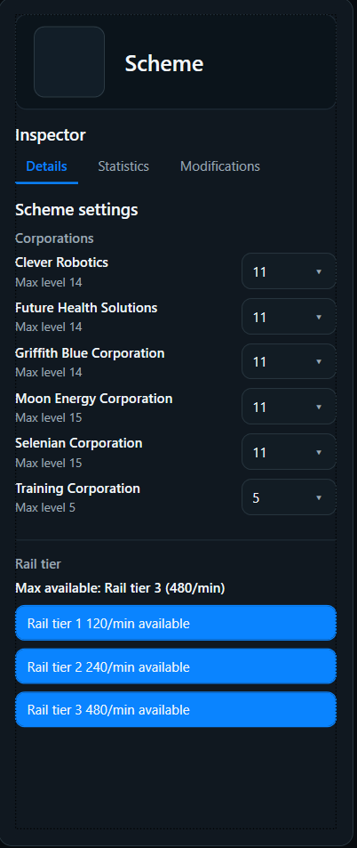

# StarRupture Production Planner

Convenient production planner for StarRupture. It helps keep supply chains, production buildings, inputs, outputs, bottlenecks, and saved schemes in one place while planning factories.

Currently the project ships as a Windows desktop planner with a bundled local API. The API also exposes an MCP server so AI agents can connect to the same production data. Later, the plan is to let MCP-connected agents help create and edit production schemes directly in the app.

## Download The App

Most users should download the Windows installer from the [StarRupture Planner releases page](https://github.com/KagasiraBunJee/star-rupture-planner/releases).

Open the latest release and download the `StarRupturePlanner-...-Setup.exe` file. The installer includes the desktop app, local API, data files, localization, and cached images, so Python is not required.

The repository has two main parts:

- `starrupture_api/`: Python data service that reads/writes the local SQLite dataset, exposes HTTP JSON endpoints, and mounts an MCP SSE server.
- `src/StarRupturePlanner/`: .NET 8 WPF desktop app for building production schemes against that local API.

## Screenshots



Canvas comment sections:



Node suggestion helper:



| Resource and machine selector | Corporation level settings |
| --- | --- |
|  |  |

## Requirements For Development

- Windows for the WPF desktop app.
- .NET 8 SDK for building and running `StarRupturePlanner`.
- Packaged desktop builds bundle the API as `api\StarRuptureApi.exe`, so users do not need Python.
- Python 3.11+ is recommended only for source/API development.
- Python packages used by the source API server: `uvicorn`, `starlette`, and `mcp`.

There is currently no checked-in Python dependency manifest. For a fresh environment:

```powershell
python -m venv .venv
.\.venv\Scripts\Activate.ps1
python -m pip install --upgrade pip
python -m pip install uvicorn starlette mcp
```

## Data And API

The Python service stores data in `data/starrupture.sqlite3` and serves cached image assets from:

- `data/assets/items`
- `data/assets/buildings`

Run the HTTP API and MCP SSE server:

```powershell
python -m starrupture_api.main serve --host 127.0.0.1 --port 8010
```

Inspect one item payload from the command line:

```powershell
python -m starrupture_api.main item rotor
```

The HTTP app is a Starlette app created by `starrupture_api.http_app:create_app`. It uses one shared `ResourceService`, so HTTP routes and MCP tools read the same SQLite dataset and localization files.

## HTTP Endpoints

Common endpoints:

- `GET /api/meta`
- `GET /api/items?q=rotor`
- `GET /api/items?produced=true&used=true&limit=100&offset=0`
- `GET /api/items/{item_id}`
- `GET /api/buildings`
- `GET /api/corporations`
- `GET /api/corporations/{corporation_id}`
- `GET /api/planner/catalog?lang=en`
- `GET /api/planner/suggestions?direction=input&item_id=titanium-bar&lang=en`
- `GET /api/planner/transport-tiers?lang=en`
- `GET /assets/items/{filename}`
- `GET /assets/buildings/{filename}`

Supported language codes are normalized by the API; current localization files live in `data/localization`.

`GET /api/items/{item_id}` returns the item, unlock relationships, producers, and consumers.

Planner endpoints are graph-oriented for the desktop app:

- `catalog` returns buildings, recipes, active ports, rates, corporation unlocks, images, localization metadata, and transport tier config.
- `suggestions` returns compatible preselected recipes for drag-release connection popovers.
- `transport-tiers` reads `data/transport_tiers.json`; if tiers are missing, the planner can still run and show missing transport recommendations.

## MCP Server

The MCP server is mounted into the same Starlette app:

- SSE endpoint: `http://127.0.0.1:8010/mcp/sse`
- Message endpoint: `http://127.0.0.1:8010/mcp/messages/`

Available MCP tools:

- `search_items(query, limit = 20, language = "en")`
- `get_item_detail(item_id, language = "en")`
- `get_dataset_meta()`
- `list_corporations(language = "en")`
- `get_corporation_detail(corporation_id, language = "en")`

Use the MCP server when an AI client needs StarRupture production facts without manually calling HTTP endpoints. Use the HTTP API when building UI, scripts, or direct integrations.

## Desktop Planner

Run from source:

```powershell
dotnet run --project src\StarRupturePlanner\StarRupturePlanner.csproj
```

The planner starts the local API automatically on `127.0.0.1:8010` when needed. Release packages prefer the bundled API executable:

```powershell
api\StarRuptureApi.exe serve --host 127.0.0.1 --port 8010
```

Source/development layouts fall back to searching upward from the app directory and current working directory until `starrupture_api` is found, then start:

```powershell
python -m starrupture_api.main serve --host 127.0.0.1 --port 8010
```

If another managed API process is already listening on that port but does not match the expected current catalog shape, the app tries to stop that stale process and start the bundled or repo-local API.

Main workflow:

1. Start the planner.
2. Wait for the status bar to report that the local API/catalog loaded.
3. Drag machines, recipes, and saved scheme outputs onto the canvas.
4. Connect matching output and input ports.
5. Use the inspector to set machine counts, recipe choices, priorities, output-only nodes, and scheme outputs.
6. Save schemes and reuse marked outputs as blueprint source nodes in other schemes.

Default user files:

- Schemes: `Documents\StarRupture Planner\Schemes`
- Settings: `%LOCALAPPDATA%\StarRupture Planner\settings.json`
- App log: `%LOCALAPPDATA%\StarRupture Planner\app.log`

The Settings window controls planner language, dark/light/system theme, canvas-card font, left-list font, and current rail tier.

## Build From Sources

Restore and build the WPF app:

```powershell
dotnet restore src\StarRupturePlanner\StarRupturePlanner.csproj
dotnet build src\StarRupturePlanner\StarRupturePlanner.csproj
```

Build release:

```powershell
dotnet build src\StarRupturePlanner\StarRupturePlanner.csproj -c Release
```

Publish a self-contained Windows x64 build:

```powershell
dotnet publish src\StarRupturePlanner\StarRupturePlanner.csproj -c Release -r win-x64 --self-contained -p:PublishSingleFile=true -o publish\StarRupturePlanner-win-x64
```

Packaged desktop builds include a bundled API executable. Local source publishes still need Python if you run the published WPF app outside the packaged app layout.

## Tests

Run Python tests:

```powershell
python -m unittest discover -s tests
```

Run the .NET planner test harness:

```powershell
dotnet run --project tests\StarRupturePlanner.Tests\StarRupturePlanner.Tests.csproj
```
